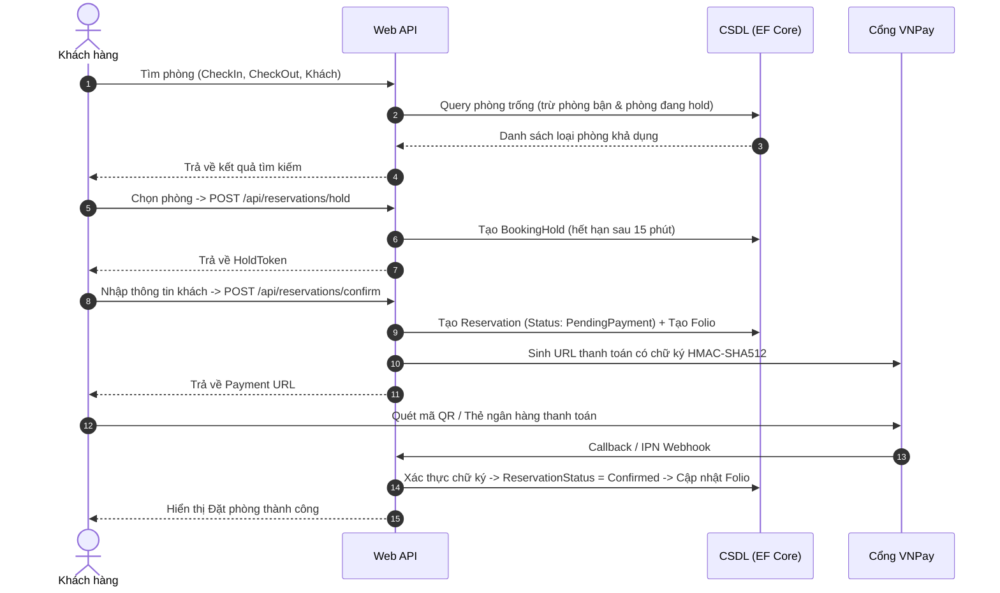
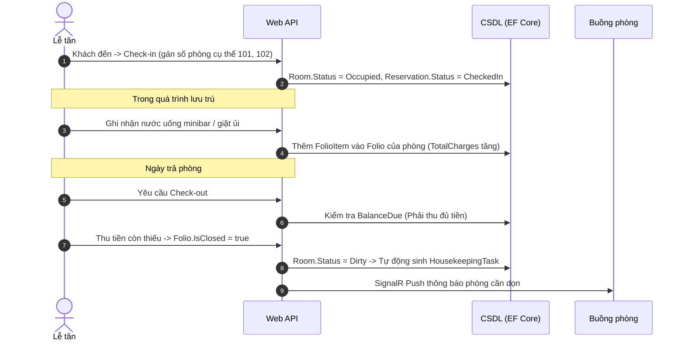

# Đặc Tả Yêu Cầu Nghiệp Vụ (System Business Specification)

## 1. Đối Tượng Người Dùng (Actors)

### 1.1. Khách Hàng (Customer / Guest)
- Duyệt danh sách các cơ sở lưu trú (khách sạn, resort, homestay).
- Tìm kiếm phòng theo địa điểm, khoảng ngày (Check-in, Check-out), số lượng người lớn/trẻ em.
- Chọn phòng và tạo phiên giữ chỗ tạm thời (Booking Hold) trong 15 phút.
- Thanh toán trực tuyến qua cổng VNPay Sandbox hoặc chọn thanh toán tại quầy (tùy chính sách cơ sở).
- Tra cứu lịch sử đặt phòng bằng mã đặt phòng hoặc tài khoản cá nhân.

### 1.2. Cơ Sở Lưu Trú (Property / Hotel Tenant)
Cơ sở đăng ký tài khoản và được phân quyền sử dụng hệ thống tùy theo **Gói Dịch Vụ (Feature Tiers)**:

| Phân hệ chức năng | Gói BASIC | Gói PRO | Gói ENTERPRISE |
| :--- | :---: | :---: | :---: |
| **Quản lý Thông tin Cơ sở & Phòng** | ✅ | ✅ | ✅ |
| **Tìm kiếm & Đặt phòng Trực tuyến** | ✅ | ✅ | ✅ |
| **Check-in / Check-out Cơ bản** | ✅ | ✅ | ✅ |
| **Quản lý Hồ sơ Quyết toán (Guest Folio)** | ❌ | ✅ | ✅ |
| **Dịch vụ Gia tăng (Minibar, Giặt ủi, Nhà hàng)** | ❌ | ✅ | ✅ |
| **Phân quyền Nhân viên (Lễ tân, Buồng phòng)** | ❌ | ✅ | ✅ |
| **Bảng điều khiển Buồng phòng Kanban (SignalR)** | ❌ | ✅ | ✅ |
| **Cấu hình Giá Linh hoạt theo Mùa (Seasonal Pricing)**| ❌ | ✅ | ✅ |
| **Cổng Thanh toán VNPay Riêng của Cơ sở** | ❌ | ❌ | ✅ |
| **Báo cáo Chuyên sâu Khách sạn (RevPAR, ADR, Occupancy)**| ❌ | ❌ | ✅ |

### 1.3. Admin Hệ Thống (Platform Super Admin)
- Quản lý danh sách các Cơ sở trên sàn: Xem xét, Duyệt, Kích hoạt, Tạm khóa.
- Quản lý danh mục Gói cước SaaS (`Basic`, `Pro`, `Enterprise`) và thời hạn thuê bao.
- Báo cáo tổng thể toàn sàn: Số lượng cơ sở, lượng booking phát sinh, doanh thu phí nền tảng.

---

## 2. Luồng Nghiệp Vụ Chính (Core Workflows)

### 2.1. Luồng Đặt Phòng Trực Tuyến (Online Booking Flow)

### 2.2. Luồng Vận Hành Lễ Tân & Quyết Toán (Front Desk & Folio Flow)

